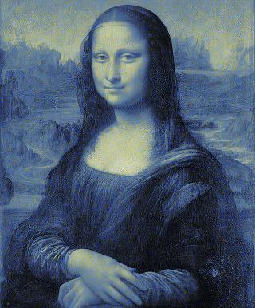
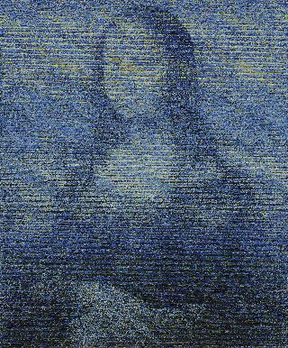
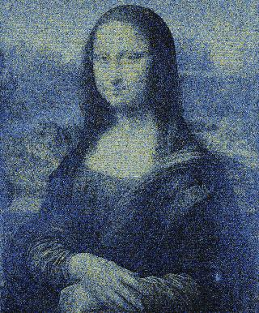
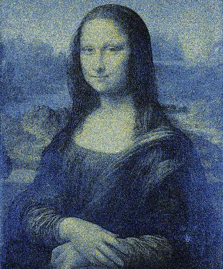
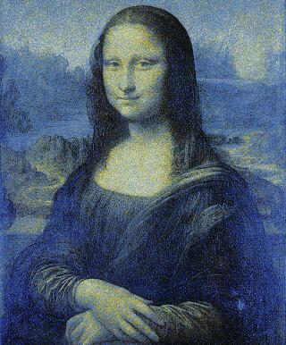

# mixel

Mixel is a small python module for recoloring images with pixels from a palette image, inspired by [this question on the codegolf stackexchange](https://codegolf.stackexchange.com/questions/33172/american-gothic-in-the-palette-of-mona-lisa-rearrange-the-pixels). 

## Install

Coming soon: 

```
$ pip install mixel
```

Dependencies are PIL, numpy, imageio, and cython. Due to cython compiler issues, this may not work on Windows.

## Usage

Basic usage:

```python
import mixel

mixel.mix('palette_image.jpg','target_image.jpg','output_image.jpg')
```

For example, if the palette image was _Starry Night_, and the target image was _Mona Lisa_, the output would look something like this:



Note that file extensions must be provided and must be correct, including for the output image.

Other arguments to the `mix` function can specify the algorithm to be used, options to those algorithms, and whether to animate the final result. The result would look something like this, with the same inputs as above: 


The code for producing this animation is sourced from user [Calvin's Hobbies](https://codegolf.stackexchange.com/users/26997/calvins-hobbies) on the codegolf stackexchange. 

## Algorithm

Three algorithms are available. The default is `sort`, which sorts pixels from both images by luminance (conversion to YIQ color space and taking the Y value). The second option is `anneal`, which randomly swaps pixels if the result would be closer to the target image, or randomly swaps with decreasing probability, similar to a [simulated annealing algorithm](https://en.wikipedia.org/wiki/Simulated_annealing). This algorithm is inspired by user [aditsu](https://codegolf.stackexchange.com/users/7416/aditsu). The third option is `hybrid`, which sorts first, then swaps with the annealing algorithm. This produces faster convergence. 

Typically, `sort` is faster than `anneal`, but `anneal` can achieve better results in the long run as it is more sensitive to colors. The speed of `sort` depends on target image size (but not palette), while the speed of `anneal` depends on how many iterations it is allowed to run for, so they are not directly comparable. Here we can compare the performance of `sort` on various image sizes.

Target Image Size | 160x193 | 320x386 | 640x772 | 960x1158 
 --- | --- | --- | --- | --- 
**Time (s)** | 1.09 | 4.33 | 18.19 | 39.56

Here we can compare the perfomance of `anneal` by stopping it at various numbers of iterations, with target image size 320x386. 

Number of Iterations | 100K | 500K | 1M | 2.5M (default)
 --- | --- | --- | --- | --- 
**Time (s)** | 4.93 | 25.58 | 51.32 | 123.52
**Output** |  |  |  | 

## Options

Aside from the file path parameters, the below options are supported in calls to `mix`.

* algorithm: defaults to `sort`. Controls which of the above three algorithms should be used (can be any of `sort`, `anneal`, or `hybrid`). 
* verbose: defaults to `True`. Whether printouts should be enabled.
* animate: defaults to `False`. Whether to animate the output. Note that the output will also be animated if the output path ends in .gif.
* anneal\_options: input options to the `anneal` algorithm. A dictionary which can contain the following keys:
    * rgb\_weights: defaults to (0.114,0.587,0.299). A tuple or other iterable which controls the relative weight of red, green, and blue in the calculation of distance between pixels. A higher value indicates a larger weight.
    * init\_rand: defaults to 0. The initial chance that two pixels will be randomly swapped even if they do not produce a better image. This value decays exponentially.
    * rand\_decay: defaults to 0. The time constant on the exponential decay above. A higher value implies a faster decay. 
    * n\_steps: defaults to 2.5M. The number of swaps to attempt.
    * stop\_limit: if n\_steps is not specified, and if for stop\_limit attempted swaps none produce a better image, then return the result.
    * luma\_weight: defaults to 10. Weight of luminance relative to RGB distance. A higher value implies luminance is weighted more heavily.
* animate\_options: input options to animate the output. A dictionary which can contain the following keys: 
    * background: defaults to `black`. The color of the background.
    * cycle: defaults to `False`. Whether to play the animation backwards for smooth looping, like so: 
    * n\_frames: defaults to 30. Total number of transition frames.
    * fps: defaults to 30. Frames per second.
    * start\_duration: defaults to 1. Time to display the palette image, in seconds.
    * end\_duration: defaults to 1. Time to display the output image, in seconds.

## Todo

* Allow for passing inputs of various kinds to all functions in the module (file paths, Image objects, numpy arrays)
